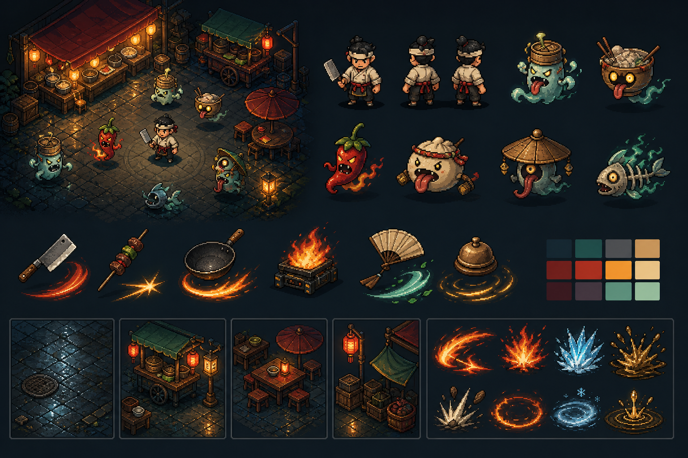

# 网页类幸存者游戏完整开发计划

> 项目代号：Web Survivor Game  
> 暂定内容方向：《山海夜市》  
> 文档版本：v1.0  
> 制定日期：2026-08-29  
> 目标团队：1 名全职开发者，或 1 名开发 + 1 名兼职美术/音频  
> 预计工作量：约 193 个理想人日  
> 预计周期：单人全职公开 MVP 约 8～10 个月；1 名开发 + 1 名美术并行约 5～7 个月；灰盒完整一局约 5～6 周

## 1. 执行摘要

本项目是一款浏览器优先的 2D 俯视角类幸存者游戏。玩家控制一名夜市摊主，在 10～15 分钟的一局中移动、自动攻击、收集经验与食材、组合厨具和口味，逐渐构筑出夸张的“战斗厨房”，最终击败 Boss。

技术方案固定为：

- Phaser 4.2.1，锁定精确版本；
- TypeScript + Vite + pnpm；
- Phaser Arcade Physics 处理玩家、边界和少量关键碰撞；
- 对象池 + 空间哈希 + 轻量圆形碰撞处理大量敌人和投射物；
- Phaser Sound 处理 Web Audio 与浏览器音频解锁；
- HTML/CSS 处理启动、设置、帮助、许可和外围页面；
- localStorage 保存小型设置与进度，复杂记录后续迁移到 IndexedDB；
- Vitest、Playwright、浏览器实机矩阵共同组成测试体系；
- Cloudflare Pages 或等价静态托管提供正式试玩链接，同时发布 itch.io HTML5 包。

第一版不开发多人联机、账号系统、排行榜、服务端背包、广告、支付、复杂寻路、PWA 和原生封装。只有核心循环通过玩家测试后才允许扩大范围。

官方技术依据见 [Phaser 文档](https://docs.phaser.io/)、[Phaser 4.2.1 包信息](https://github.com/phaserjs/phaser/blob/master/package.json)、[Phaser 物理系统](https://docs.phaser.io/phaser/concepts/physics)、[Phaser 音频](https://docs.phaser.io/phaser/concepts/audio)、[Vite 静态部署](https://vite.dev/guide/static-deploy.html) 与 [itch.io HTML5 发布要求](https://itch.io/docs/creators/html5)。

## 2. 产品定义

### 2.1 一句话卖点

> 经营一辆被妖怪围攻的山海夜市餐车：厨具决定攻击方式，口味改变攻击属性，组合菜谱把一局构筑成一台荒诞的战斗厨房。

“山海夜市”是工作主题，不是不可更改的品牌承诺。技术和数据结构必须允许以后替换题材，而不重写战斗系统。

### 2.2 体验支柱

1. **五秒反馈：** 移动、命中、击退、掉落和音效必须即时、清晰、有节奏。
2. **每分钟决策：** 玩家持续面对可理解但不显然的构筑选择，而不是只选数值更大的道具。
3. **十分钟成长：** 一局必须从“勉强自保”成长到“视觉和机制都明显夸张”的完成构筑。
4. **失败可学习：** 结算页明确显示死亡原因、核心输出、构筑标签和可尝试的新方向。
5. **立即再来：** 从结算到下一局可操作不超过 10 秒。

### 2.3 核心循环

```text
选择角色与初始厨具
  → 45～60 秒战斗波次
  → 收集“热度”（经验）和“食材”（商店/菜谱资源）
  → 升级三选一
  → 波次结束进入 15～20 秒夜市整备
  → 购买、锁定、刷新、合成厨具或口味
  → 精英波与 Boss 波
  → 结算、解锁、新构筑再开一局
```

建议一局 12 波：第 4、8 波引入新的敌人组合，第 6 波为精英检验，第 12 波为 Boss。波次具体时长由试玩数据决定，不作为不可调整的规则。

### 2.4 独特系统：厨具 × 口味 × 菜谱

厨具负责攻击几何，口味负责状态与传播方式，菜谱负责达到标签条件后的质变。

| 层 | 示例 | 设计责任 |
|---|---|---|
| 厨具 | 菜刀、竹签、铁锅、炉火、折扇、上菜铃 | 投射、穿透、环绕、范围、击退、召唤 |
| 口味 | 辣、冰、油、糖、发酵 | 点燃、减速、扩散、暴击、持续伤害 |
| 菜谱 | 爆炒火环、冰镇串烧、甜味小帮厨 | 达成 2/4/6 标签或特定组合后改变行为 |
| 角色 | 爆炒师、冷饮师、串烧师 | 用优势、限制和初始条件迫使不同取舍 |

组合必须数据驱动。第一版只实现经过设计的 8～12 个有效组合，不承诺所有厨具和口味都产生独立最终形态，避免组合数量爆炸。

### 2.5 MVP 内容边界

| 内容 | 公开 MVP | 后续小型正式版目标 |
|---|---:|---:|
| 地图 | 1 | 3 |
| 角色 | 3 | 8 |
| 厨具/武器 | 8～12 | 24 |
| 被动道具/口味 | 20～30 | 80 |
| 普通敌人 | 6 | 15 |
| 精英 | 2 | 6 |
| Boss | 1 | 4 |
| 难度 | 3 | 5+ |
| 单局时长 | 10～15 分钟 | 12～18 分钟，多模式可变 |

正式版数量不是 MVP 开发承诺。只有指标证明内容扩充能提升留存，才进入下一阶段。

### 2.6 明确不做

- 不做在线多人、实时 PvP 或合作；
- 不做玩家账号、云存档和跨设备同步；
- 不做全球排行榜，避免先处理作弊与服务端权威问题；
- 不做需要每个敌人独立 A* 的迷宫地图；
- 不做剧情对话树、任务系统和大型世界地图；
- 不做付费、广告、登录奖励和每日任务；
- 不为“未来也许需要”提前建设通用 ECS、编辑器或微服务。

## 3. 成功标准

### 3.1 玩法标准

- 开局 3 秒内可以移动或造成第一次攻击；
- 45～60 秒内出现第一次有意义的升级选择；
- 第 4 波前形成可描述的构筑身份；
- 试玩者能说出至少两种明显不同的构筑；
- 失败后至少 40% 的内部试玩者愿意立刻再开一局；
- 结算能解释主要伤害来源和死亡原因；
- 连续三局不会因为随机池失效而出现“完全无法成型”的体验。

### 3.2 技术预算

- 中端桌面 Chrome/Edge/Firefox：目标 60 FPS；
- 近三年中端手机低画质档：目标稳定 30 FPS；
- 压力场景至少支持 500 个活动敌人、1000 个投射物/效果对象的项目级基准；
- 首个可交互版本压缩后尽量不超过 3～5 MB；
- 20 分钟压力测试内存不持续爬升；
- 切后台再回来不会补算隐藏期间的战斗；
- 没有未捕获异常、永久黑屏或无法恢复的音频锁定；
- 存档版本升级可迁移，损坏存档可回退到安全默认值。

性能数字是验收预算，不是框架保证。每一阶段都必须在真实浏览器中测量。

### 3.3 可访问性和舒适度

- 键盘可重映射；
- 支持键鼠和触摸；手柄作为后续增强；
- 屏幕震动、命中停顿强度、伤害数字、闪光、音乐和音效可以调整；
- 关键信息不只依靠红绿颜色区分；
- 低画质档只改变表现，不改变伤害、刷怪和掉落；
- HUD 避开移动端刘海和底部手势区域。

## 4. 技术架构

### 4.1 技术栈

| 层 | 选择 | 约束 |
|---|---|---|
| 包管理 | pnpm + lockfile | CI 与本地使用同一主版本 |
| 语言 | TypeScript strict | 禁止在战斗核心使用无说明的 `any` |
| 构建 | Vite | 所有资产使用相对路径和内容哈希 |
| 引擎 | Phaser 4.2.1 | 精确锁版本，升级单独建任务并完整回归 |
| 数据校验 | Zod 或等价 schema 校验 | 开发与 CI 阶段阻止错误内容进入构建 |
| 单测 | Vitest | 战斗公式、随机池、波次、存档迁移、内容校验 |
| 端到端 | Playwright | 启动、开始一局、升级、商店、结算、存档 |
| 代码质量 | ESLint + Prettier | CI 必须运行 typecheck/lint/test/build |
| 发布 | 静态托管 + itch.io | 不依赖服务器运行核心游戏 |

### 4.2 分层原则

```text
HTML/CSS Shell
  ├─ 启动、设置、帮助、许可、加载错误
  └─ Phaser Canvas
       ├─ Scene：Boot / Preload / Menu / Run / Results
       ├─ Presentation：Sprite / Animation / VFX / Audio / HUD
       └─ Simulation
            ├─ Input / Movement / Spawn / Steering
            ├─ Targeting / Weapon / Projectile / Hit
            ├─ Damage / Status / Death / Drops
            ├─ XP / LevelUp / Shop / Recipe
            └─ RNG / Wave / Save Snapshot / Metrics
```

核心规则不得直接依赖具体贴图、动画帧或 DOM。表现层监听类型化事件，例如 `DamageApplied`、`EnemyDied`、`RecipeActivated`，再播放音效和特效。

### 4.3 推荐目录

```text
src/
  app/                  # HTML 壳、启动流程、错误边界
  game/
    scenes/             # Phaser scenes
    simulation/         # 固定步长和世界状态
    systems/            # 移动、攻击、伤害、掉落等
    entities/           # 轻量数据、池和句柄
    spatial/            # 空间哈希与查询
    presentation/       # Sprite 同步、动画、VFX、音频
    ui/                 # HUD、升级、商店、结算
  content/
    characters/
    weapons/
    items/
    enemies/
    waves/
    recipes/
    schemas/
  save/                 # schema、迁移、存储适配器
  platform/             # 输入、可见性、移动端、安全区
  debug/                # 调试面板、作弊菜单、性能采样
  tests/
public/
  assets/
    bootstrap/          # 启动页和首屏必需资源
    common/
    biome-night-market/
    audio/
docs/
art/
```

### 4.4 游戏循环

- 使用 `requestAnimationFrame` 渲染；
- 战斗模拟采用固定步长或严格封顶 delta，初始基准为 60 Hz；
- 每帧最多补算 4 个模拟步，超过部分丢弃并记录指标；
- 页面隐藏时自动暂停；恢复时清空 accumulator，不补算离开期间；
- 随机数通过带种子的项目 RNG 生成，不能在核心系统中散落 `Math.random()`；
- 调试构建支持固定 seed、单步模拟、倍速、无敌和直接跳波。

### 4.5 实体、池和空间查询

- 敌人、投射物、掉落物、伤害数字、临时特效都必须池化；
- 世界状态保存稳定 ID，表现对象通过映射关联，禁止把 Sprite 当领域模型；
- 空间哈希单元格尺寸以最大常见交互半径为起点，通过基准测试调整；
- 查询只扫描当前格和相邻格；
- 接触、拾取、圆形范围伤害使用距离平方；
- 高速投射物使用线段扫掠或多采样，避免穿透；
- 远离摄像机的敌人降低决策频率，但移动结果必须保持可预测；
- 只有玩家、地图边界和少量关键对象进入 Arcade Physics。

### 4.6 战斗模型

战斗顺序固定为：

```text
Targeting → AttackIntent → SpawnAttack
→ CollisionQuery → HitCandidate
→ DamagePipeline → Status/Knockback
→ Death → Drop → PresentationEvents
```

伤害流水线应明确：基础伤害、武器倍率、全局倍率、暴击、敌人减伤、状态修正、最终取整。所有修正器拥有稳定 ID、来源和优先级，结算页能按来源汇总。

首批攻击模式：

- 定向投射物；
- 穿透直线；
- 近战弧形；
- 环绕物；
- 地面持续区域；
- 自动召唤物。

首批效果组件：直接伤害、击退、点燃、减速、持续伤害、暴击修正、范围扩散。链式攻击和复杂召唤 AI 只有在基础组件稳定后加入。

### 4.7 内容数据结构

示意结构：

```ts
type WeaponDefinition = {
  id: string;
  nameKey: string;
  tags: string[];
  attackPattern: 'projectile' | 'arc' | 'orbit' | 'area' | 'summon';
  targeting: 'nearest' | 'forward' | 'random' | 'lowestHp';
  cooldownMs: number[];
  effects: EffectDefinition[];
  levels: WeaponLevelDefinition[];
  assetKey: string;
};
```

数据要求：

- 所有 ID 稳定、全局唯一且不使用中文路径；
- 显示文本通过本地化 key 访问；
- 数值数组长度和稀有度层级由 schema 校验；
- 引用不存在的敌人、武器、标签、贴图或音效时 CI 失败；
- 内容表支持 seed 重放和自动平衡模拟；
- 旧存档只保存稳定 ID，不保存运行时对象。

### 4.8 输入与 UI

- 桌面默认 WASD/方向键移动，Esc 暂停；
- 触摸使用左下跟手虚拟摇杆，右侧只在主动技能存在时显示按钮；
- 鼠标主要用于菜单，不依赖 hover 承载关键说明；
- 逻辑视口固定，画面用 FIT 缩放；宽屏只展示额外背景，不改变刷怪和攻击距离；
- UI 显示安全区、低血量、升级可选、商店资源和波次信息；
- 道具文案使用“效果 + 条件 + 代价”格式，避免隐藏规则；
- 升级和商店打开时模拟完全暂停，表现动画允许低频继续。

### 4.9 音频

- 首屏提供明确的“点击开始”，之后才初始化/解锁音频；
- 总音量、音乐、音效分开保存；
- 同类命中音设置每帧并发上限并做轻微音高变化；
- 战斗 SFX 优先短音频，背景音乐分包；
- 切后台暂停音乐，恢复时平滑淡入；
- 每个音频必须在素材台账记录来源、许可、编辑过程和响度处理。

### 4.10 存档

第一版保存：设置、解锁、教程状态、最高难度、统计摘要、`schemaVersion`。

- 小型 JSON 使用 localStorage；
- 写入发生在设置变更、解锁、购买和结算，不在每帧执行；
- 保存前生成校验数据，保留一份最近成功快照；
- 加载失败时保留原始损坏数据，启动安全默认值并提示玩家；
- 每次 schema 变化必须增加迁移测试；
- run history、回放和较大结构以后迁移到 IndexedDB；
- 付费货币、排行榜和竞争结果不得信任纯前端数据。

## 5. 美术、音频与素材计划

### 5.1 视觉方向

项目视觉锚点为：



参考板由内置 imagegen 生成，文件为 `art/reference/shanhai-night-market-art-direction-v1.png`，仅用于统一方向，不是直接上线的 sprite sheet。

视觉规范初稿：

- 三分之四俯视角；
- 32～48 像素角色语言，最终统一到一个逻辑网格；
- 暗青、炭黑作为背景，琥珀灯光、辣椒红、玉绿色作为强调；
- 深色统一描边，角色、敌人、投射物轮廓必须在混战中可辨；
- 玩家、友方召唤、敌人、危险预警和掉落物使用不同明度区间；
- 地面低对比，攻击与危险高对比；
- 不把生成式概念图直接切片上线；必须重绘、切图、透明边缘修整、动画和实机测试。

### 5.2 素材策略

1. Kenney CC0 作为 UI、输入提示、占位地面、通用粒子和原型音效底座；
2. Game-icons.net 补充武器、状态、技能图标，并在 Credits 中逐作者署名；
3. OpenGameArt 和 itch.io 只使用页面和包内明确标注 CC0/CC BY 或明确商业许可的具体素材；
4. Freesound 商业项目只选择 CC0/CC BY，并逐音频记录作者与 URL；
5. Sonniss GDC Bundle 用于高质量战斗和环境音效，保存下载当日许可；
6. Noto Sans SC/思源黑体提供中文 UI 字体，打包实际需要的字重或子集；
7. 角色、妖怪、厨具武器、Boss 和主视觉保持原创，以参考板为方向，生成概念后人工像素级重绘。

具体候选、链接、许可证和缺口记录在 [ASSET_RESEARCH.md](./ASSET_RESEARCH.md)。

### 5.2.1 已选原型素材组合

经过逐项许可核验，原型阶段固定使用以下组合，不继续混搭第二套角色画风：

| 用途 | 已选素材 | 许可 | 采用方式 |
|---|---|---|---|
| 原型统一视觉/动画/音乐底座 | [Ninja Adventure - Asset Pack](https://pixel-boy.itch.io/ninja-adventure-asset-pack)，Pixel-Boy | CC0 | 使用其 16×16 地图、角色、怪物、Boss、VFX、SFX 和音乐完成玩法验证；正式版逐步替换主题核心 |
| UI | [UI Pack - Pixel Adventure](https://kenney.nl/assets/ui-pack-pixel-adventure)，Kenney | CC0 | 选择一套边框和九宫格规则，按夜市色板统一调色 |
| 输入提示 | [Input Prompts Pixel](https://kenney.nl/assets/input-prompts-pixel)，Kenney | CC0 | 键鼠、通用手柄和触摸提示；只打包实际使用子集 |
| 通用 UI/命中音效 | [Interface Sounds](https://kenney.nl/assets/interface-sounds)、[Impact Sounds](https://kenney.nl/assets/impact-sounds)，Kenney | CC0 | 精选变体并统一响度；不整包进入 production |
| 厨具图标底稿 | [Game-icons.net Kitchenware](https://game-icons.net/tags/kitchenware.html) | CC BY 3.0 | 只选择实际使用的 8～12 个，逐作者登记并重绘为 24/32px 像素图标 |
| 正文字体 | [Noto Sans SC](https://github.com/notofonts/noto-cjk) | SIL OFL 1.1 | Regular 400 + Semibold 600，自托管 WOFF2 并按字符清单子集化 |
| 短标题字体 | [得意黑 / Smiley Sans](https://github.com/atelier-anchor/smiley-sans) | SIL OFL 1.1 | 仅用于标题、Boss 名和菜谱解锁；逐字检查 |
| 主题音效缺口 | Freesound 中已核验的 CC0 炒锅、whoosh、铃声 | CC0 | 逐条保存声音 ID、作者、URL、下载日和编辑记录 |

正式版明确原创：3 名玩家、6 类普通妖怪、2 类精英、1 个 Boss、8～12 件厨具世界精灵、完整夜市场景、菜谱/物品图标、主题 VFX、主标题、正式战斗音乐和料理 Foley。继续搜索“完全匹配的免费整包”不再是关键路径。

### 5.3 素材台账

从第一天维护：

```text
asset_id, local_path, title, author, source_url, license,
license_url, downloaded_at, modified, evidence_path, sha256
```

每个外部素材同时保存：下载包、LICENSE/README、页面 PDF 或截图、下载日期和哈希。任何无法证明许可的素材不能进入 release bundle。

### 5.4 资产生产规格

- 先确定逻辑像素网格、角色碰撞半径和相机缩放，再生产动画；
- 角色至少包含 idle、move、hurt、death；自动攻击由武器独立表现；
- 普通敌人至少包含 move、hurt、death；精英/Boss 另有 telegraph 与 attack；
- 每个攻击必须有起手、危险预警、命中和结束四类表现中的必要部分；
- 图集四周外扩 1～2 像素避免采样缝；
- 透明图片去除半透明脏边；
- 音频统一响度并保留无损母版，发布使用压缩格式；
- 所有资产由 manifest 引用，不在代码中散落路径字符串。

## 6. 测试策略

### 6.1 测试金字塔

| 层 | 工具 | 覆盖内容 | 运行频率 |
|---|---|---|---|
| 静态 | TypeScript、ESLint、schema | 类型、引用、内容合法性 | 每次提交 |
| 单元 | Vitest | 伤害、随机、标签、商店、波次、迁移 | 每次提交 |
| 模拟 | Headless simulation | 固定 seed、DPS、刷怪、掉落、性能 | 每次合并 |
| 浏览器 E2E | Playwright | 启动、开局、升级、商店、结算、重载 | 每次合并/发布 |
| 视觉 | 截图基线 + 人工检查 | HUD、缩放、安全区、危险可读性 | 每阶段 |
| 性能 | 浏览器 Performance/Memory | FPS、长任务、GC、内存、首包 | 每阶段门禁 |
| 实机 | Chrome/Firefox/Safari/iOS/Android | 输入、音频、iframe、温度、后台恢复 | 每阶段后期 |
| 试玩 | 观察 + 问卷 + run summary | 学习成本、构筑、难度、再开意愿 | P1 起每阶段 |

### 6.2 每阶段统一测试流程

1. 运行 `typecheck`、`lint`、单测和 production build；
2. 在固定 seed 下运行自动模拟，比较核心指标；
3. Playwright 完成关键路径；
4. Chrome、Firefox、Safari 各完成一次人工冒烟；
5. 至少一台 iPhone 和一台中端 Android 完成当前阶段关键路径；
6. 运行本阶段压力场景并记录 FPS、最大帧耗时、内存和对象池峰值；
7. 更新已知问题、测试报告和风险表；
8. 所有阶段阻断项关闭后才能进入下一阶段。

### 6.3 缺陷等级

- P0：数据丢失、无法启动、发布包黑屏、安全问题；禁止发布；
- P1：无法完成一局、Boss/升级/商店阻断、严重性能退化；禁止过阶段；
- P2：明显玩法错误、错误数值、主要设备 UI 问题；有计划才能过阶段；
- P3：轻微视觉、文案和低频边缘问题；进入 backlog。

## 7. 阶段计划与阶段门禁

任务级拆分、依赖和估时见 [TASK_BREAKDOWN.md](./TASK_BREAKDOWN.md)。

### P0：产品与工程基线（8～10 人日）

目标：项目可以安装、测试、构建、部署空壳；范围、预算和内容规则可被团队共同理解。

交付：仓库骨架、Phaser/Vite 启动页、质量脚本、CI、内容 schema 原型、素材台账、调试环境。

测试与门禁：

- 全新环境按 README 可在 10 分钟内启动；
- typecheck/lint/test/build 全绿；
- Chrome、Firefox、Safari 都能打开空场景；
- itch.io 风格子路径和 iframe 中资源路径正确；
- 版本、范围、非目标和性能预算完成评审。

### P1：灰盒核心循环（14～18 人日）

目标：不用正式素材也能完成一局。

交付：移动、敌人追逐、一个自动武器、命中/死亡、掉落、经验、升级三选一、12 波计时、暂停、结算、重新开始。

测试与门禁：

- 固定 seed 可重复得到相同刷怪和升级池；
- 一局能从开始走到结算并立即重开；
- 300 敌人灰盒压力测试达到桌面 60 FPS；
- 切后台 30 秒恢复后不瞬间死亡或补算；
- 五名内部试玩者中至少四名无需口头解释就能完成前两波；
- P0/P1 缺陷清零。

### P2：战斗与内容框架（20～24 人日）

目标：从“一把武器的原型”升级为可扩展的内容系统。

交付：武器/效果/敌人/波次 schema，对象池，空间哈希，六种攻击模式，状态效果，击退，暴击，伤害统计，事件化表现。

测试与门禁：

- 内容引用错误会使 CI 失败；
- 所有伤害公式和状态叠加有单测；
- 500 敌人 + 1000 投射物基准无持续 GC 抖动；
- 连续 20 分钟 soak test 内存回到稳定区间；
- 新增一把数据驱动武器无需修改通用伤害系统；
- 至少四种攻击模式可以形成明显不同的走位。

### P3：商店、菜谱与局内构筑（16～20 人日）

目标：建立项目差异化的“厨具 × 口味 × 菜谱”构筑。

交付：夜市整备、购买、刷新、锁定、合成、标签阈值、菜谱转化、角色限制、经济曲线、构筑结算。

测试与门禁：

- 商店随机池不产生非法重复或无法购买状态；
- 菜谱激活、取消、升级和存档都可重复测试；
- 至少三条有效构筑能完成标准难度；
- 无单一选择在大多数 seed 中成为必选；
- 试玩者能用自己的话解释标签和至少一个菜谱；
- 结算页能正确汇总武器/状态/召唤物伤害。

### P4：垂直内容切片（26～32 人日）

目标：达到完整内容规模并验证节奏，不追求最终美术。

交付：3 角色、8～12 武器、20～30 道具、6 普通敌人、2 精英、1 Boss、1 地图、3 难度、教程和完整波次表。

测试与门禁：

- 每个角色至少有两条可行构筑；
- 每个敌人都能改变走位，而不是只更换数值；
- Boss 所有致命攻击有清晰预警；
- 连续 100 个自动/半自动 seed 不出现波次空池或无限循环；
- 十名新试玩者完成首局后的中位游玩时长达到 8 分钟；
- 难度曲线、经济、掉落和 TTK 形成版本化基线。

### P5：美术、音频与手感（34～42 人日）

目标：用统一资产替换灰盒，让命中、危险和构筑质变可感知。

交付：最终玩家/敌人/Boss 精灵，夜市场景，图标，HUD，攻击/VFX，UI/战斗 SFX，一首循环音乐，Credits 和素材证据。

测试与门禁：

- 100% release 资产可追溯到原创文件或有效许可证；
- 关闭声音时仍能通过视觉预警理解危险；
- 色弱/低亮度检查中玩家、敌人、危险和掉落保持可分；
- 最差战斗画面不被伤害数字和粒子遮挡；
- 音效同帧限流，没有明显爆音；
- 新增资产后首包、显存和内存仍满足预算。

### P6：移动端与性能硬化（17～21 人日）

目标：让真实手机和嵌入页面达到可发布体验。

交付：触摸摇杆、安全区、响应式 HUD、30/60 FPS、低画质档、DPR 限制、分包加载、内存治理、iframe 适配。

测试与门禁：

- iPhone Safari 和中端 Android Chrome 都能完成一局；
- 低画质档最差波次达到目标帧率；
- 连续 20 分钟设备不过度发热到导致不可玩；
- 来电/锁屏/切后台后可以恢复；
- 横竖屏变化给出正确处理，不出现操作区移位；
- itch.io fullscreen 与嵌入两种模式通过。

### P7：存档、设置与可访问性（10～14 人日）

目标：保证玩家设置和解锁稳定、可恢复、可理解。

交付：版本化存档、迁移、备份回退、键位、音量、震动、闪光、伤害数字、语言/字体加载、错误提示。

测试与门禁：

- 空、旧、损坏、超大和配额失败存档都有测试；
- 重载页面后解锁和设置保持；
- 删除站点数据后游戏能安全重新初始化；
- 键盘可完成外围菜单；
- 关闭震动/闪光/伤害数字后游戏仍可玩；
- 中文字符无缺字和布局溢出。

### P8：平衡、QA 与发布候选（16～20 人日）

目标：冻结功能，集中修复、调数值和验证留存假设。

交付：版本化平衡表、seed 回归库、测试报告、设备矩阵、已知问题、发布候选构建。

测试与门禁：

- 全测试套件和内容审计通过；
- 所有 P0/P1/P2 缺陷关闭；
- 30 次以上外部试玩形成可分析记录；
- 三个角色和主要构筑通关率处于设计区间；
- 无明显“必选”或“陷阱”道具；
- 发布候选在目标设备进行 30 分钟 soak test；
- 候选版本冻结 48 小时只接受阻断修复。

### P9：发布与观察（6～9 人日，不含不可预测热修）

目标：可回滚地发布，收集真实反馈，不立即扩大范围。

交付：正式静态站、itch.io 页面、版本号、更新日志、Credits、隐私说明、反馈入口、回滚包。

测试与门禁：

- 生产域名、缓存、HTTPS、404 和相对路径正确；
- 新用户无缓存与老用户有缓存两种路径通过；
- itch.io ZIP 根目录包含 `index.html` 且大小写正确；
- 线上完成开始、升级、商店、Boss、结算、重载全流程；
- 上一稳定版可在 10 分钟内恢复；
- 发布后 72 小时只处理崩溃、阻断、数据和严重平衡问题。

## 8. 发布策略

### 8.1 环境

- `development`：调试面板、作弊和详细日志；
- `preview`：每次合并生成可分享地址；
- `production`：关闭作弊、压缩、内容哈希、错误摘要；
- `itch`：相对路径、iframe、全屏与包大小专项配置。

### 8.2 版本和回滚

- 使用语义化版本和版本化存档 schema；
- 每个 production 构建保存 commit、lockfile、资产清单和输出哈希；
- 保留上一稳定版产物；
- Phaser 升级、内容 schema 变化和存档迁移不得混在同一次高风险发布；
- 发布前生成变更摘要和已知问题。

### 8.3 发布后观察

第一版只收集必要、匿名的本地或用户授权指标：启动成功、完成波次、角色/武器选择、死亡原因、平均 FPS 档位和异常摘要。没有隐私说明前不接第三方追踪。

决定是否继续的核心问题：

- 玩家是否理解菜谱系统；
- 是否存在多种真正可行的构筑；
- 玩家失败后是否愿意重开；
- 移动 Web 性能是否达到目标；
- 内容生产成本是否允许继续扩充。

## 9. 风险登记

| 风险 | 可能性 | 影响 | 触发信号 | 缓解 |
|---|---|---|---|---|
| Phaser 4 新大版本插件不兼容 | 中 | 中 | 必需插件无法运行 | MVP 不依赖第三方玩法插件；精确锁版本；必要时退 3.90 |
| 同屏对象造成 GC/CPU 峰值 | 高 | 高 | 最差波次长帧增加 | P1 即对象池；P2 空间哈希；每阶段压力门禁 |
| Safari/iOS 音频和 WebGL 差异 | 中 | 高 | 实机黑屏、无声、恢复失败 | P0 起每阶段 Safari 冒烟；用户手势解锁；降级路径 |
| 免费素材风格拼贴 | 高 | 中 | UI/角色比例和轮廓不一致 | 只用一套占位底座；主题核心原创；统一色板和描边 |
| 素材许可不可证明 | 中 | 高 | 找不到原许可证或作者 | 素材台账、证据快照、release 审计；不明素材直接移除 |
| AI 概念图无法直接生产 | 高 | 中 | 动画切片和像素网格不一致 | 只当参考；人工重绘；不直接上线生成板 |
| 组合系统内容爆炸 | 高 | 高 | 每个组合都需特殊代码 | 组件化效果；MVP 只实现策划过的组合；schema 校验 |
| 平衡被少数构筑支配 | 高 | 中 | 选择率/通关率集中 | 固定 seed 回归、伤害统计、外部试玩、版本化数值表 |
| 浏览器数据被清理 | 中 | 中 | 玩家丢失解锁 | 明示本地存档；备份；后续再做账号云存档 |
| 范围膨胀 | 高 | 高 | 提前加入账号、联机、剧情 | 非目标清单；阶段门禁；新需求必须替换等量任务 |

## 10. 全局完成定义

一个任务只有同时满足以下条件才算完成：

- 代码已合并且没有未说明的调试开关；
- 有对应自动测试，或记录无法自动化的原因与人工步骤；
- typecheck、lint、test、build 通过；
- 资源和内容引用通过 schema/manifest 校验；
- 目标浏览器完成冒烟；
- 性能没有突破阶段预算；
- 外部素材进入台账并保存许可证据；
- 文档、变更日志和已知问题已更新；
- 验收条件由开发者以外的试玩者或独立复核步骤确认。

## 11. 决策记录

| 决策 | 当前选择 | 重新评估条件 |
|---|---|---|
| 游戏引擎 | Phaser 4.2.1 | 阻断插件只支持 v3；Safari 无可接受规避方案 |
| UI 框架 | 不使用 React | 图鉴、账号、活动等外围页面复杂到 DOM 状态难维护 |
| 物理 | Arcade + 自定义轻量查询 | 玩法真的需要复杂刚体、关节或多边形交互 |
| 寻路 | 首版不使用 | 地图出现影响大群移动的墙、门和通道 |
| 存储 | localStorage | 出现多槽、回放、较大历史记录或离线包 |
| 后端 | 无 | 云存档、排行榜、支付或远程配置被验证为必要 |
| 主题资产 | 原创核心 + 免费通用素材 | 找到许可证清晰、风格一致且能覆盖整套主题的素材包 |

## 12. 关联文档

- [任务拆分与阶段测试](./TASK_BREAKDOWN.md)
- [具体免费素材与许可调研](./ASSET_RESEARCH.md)
- [前序技术选型调研](/Users/sym/code/web-survivor-game-tech-selection.md)
- [美术方向参考板](../art/reference/shanhai-night-market-art-direction-v1.png)

## 13. 美术方向参考板生成记录

- 生成方式：Codex 内置 imagegen；
- 生成日期：2026-08-29；
- 输出：1536×1024 PNG；
- 用途：风格、色板、视角、轮廓和资产家族参考；
- 禁止用途：不得直接切成最终精灵，不替代逐帧动画、像素重绘和原创性复核。

最终提示词：

```text
Use case: stylized-concept
Asset type: 2D game art-direction reference board for a browser survivor game
Primary request: create a cohesive visual style board for a working-title game about a roaming Chinese night-market cook surviving waves of playful supernatural creatures; this is a production reference, not a final sprite sheet
Scene/backdrop: a clean dark neutral presentation board showing a small top-down night-market arena vignette, character and enemy silhouette lineup, weapon/tool lineup, a few environment tile samples, and compact combat-effect samples
Subject: one readable night-market cook hero; cookware weapons including cleaver, skewer, iron wok, stove flame, hand fan and service bell; six original whimsical hungry spirit enemies with distinct movement silhouettes; wet stone ground, warm lanterns, canvas awning and food cart props; fire, frost, oil-splash and impact effects
Style/medium: crisp stylized pixel-art-inspired 2D game concept, consistent three-quarter top-down perspective, chunky 32-to-48-pixel sprite language, restrained dark teal and charcoal base with warm amber, chili red and jade accents, strong one-pixel-like dark outlines, high gameplay readability
Composition/framing: landscape reference board, neatly grouped visual families with generous separation, no written labels
Lighting/mood: cozy lantern warmth against a mysterious blue-green night, playful rather than horror
Constraints: consistent scale, outline weight, perspective and palette across all elements; original designs only; no text; no logos; no trademarks; no watermark; avoid photorealism; avoid detailed background scenes that obscure the asset families
```
